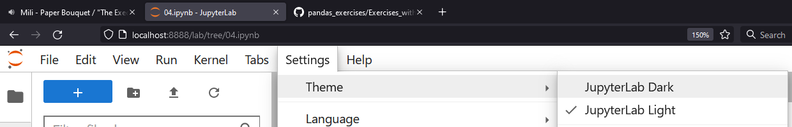
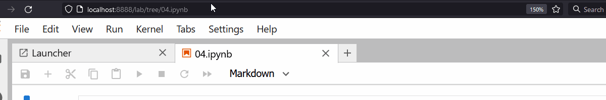
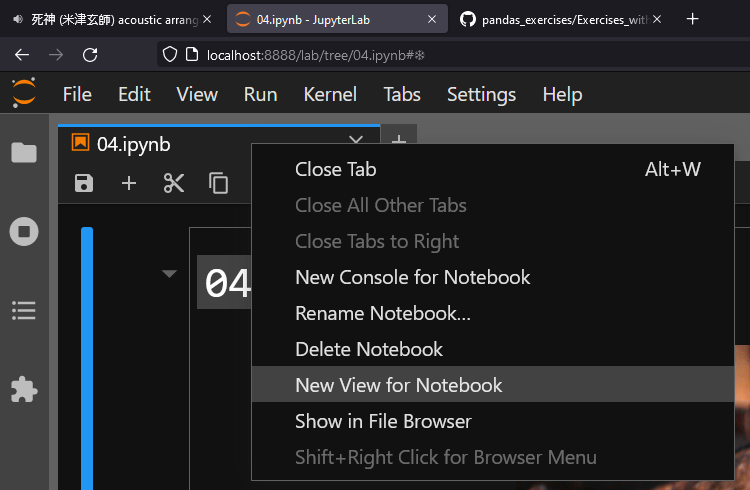
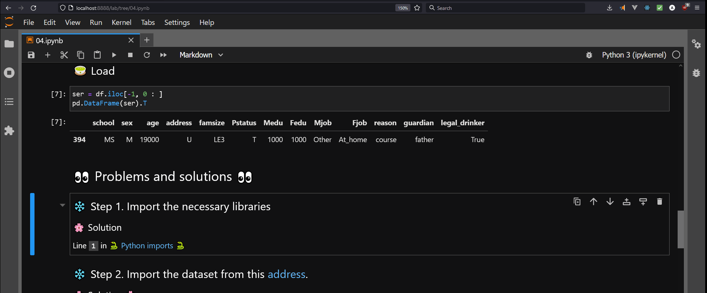

# `grading-tips.md`

## ❄ Grading tips ❄ 

### 🌸 Enable dark theme

`Settings -> Theme -> JupyterLab Dark`

    
Show image

       

    

    
Show gif

    

### 🌸 Open second notebook view

Right-click notebook tab and select `New View for Notebook`

    
Show image

        

    

    
Show gif

    

### 🌸 Show line numbers

Hit `SHIFT + L` when not editing a cell
