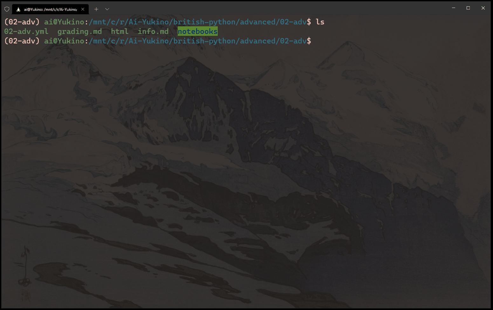

# `grading.md` for `02-adv`

---

## ❄ Quick grading ❄

If you want to see the output without running the code yourself, you can view it via `02-adv/html`. Otherwise, read on to generate the Jupyter notebook files.

## ❄ Prerequisites ❄

Make sure you have some Anaconda-inspired package and virtual environment manager installed in your system, e.g

- The original [Anaconda](https://www.anaconda.com/) Python distribution which comes with the [Conda](https://docs.conda.io/en/latest/) command-line tool for managing virtual environments,
- the smaller [Miniconda](https://docs.conda.io/en/latest/miniconda.html) Python distribution that also comes with Conda, and/or
- the [Mamba](https://mamba.readthedocs.io/en/latest/index.html) virtual environment manager and [Mambaforge](https://mamba.readthedocs.io/en/latest/installation.html#fresh-install) Python distribution

## ❄ Clone this entire repo ❄

Open a terminal and navigate to your preferred directory. Then run

```
git clone https://github.com/Ai-Yukino/british-python
```

If you think you would like to make pull-requests, it's a good idea to fork this repo and then clone the forked repo you've made instead.

## ❄ Install virtual environment ❄

Navigate to this directory, e.g.

```
cd Ai-Yukino/british-python/advanced/02-adv
```

Install the virtual environment with

```
conda env install -f 02-adv.yml
```

## ❄ Activate virtual environment ❄

Run

```
conda activate 02-adv
```

## ❄ View Jupyter notebooks ❄

Run

```
jupytyer-lab
```

Open the url

```
http://localhost:8888/lab
```

in your favorite web browser and navigate to the homework you want to grade.

## ❄ Finishing grading ❄

Open your terminal. Hit the keys

```
CTRL + C
```

to stop the Jupyter server. Deactivate the virtual environment by running

```
conda deactivate
```

## ❄ JupyterLab troubleshooting ❄

You may have a similar issue as me in the following gif.

<div align="center">
    
</div>

The issue is that your `8888` links may never finish loading. If you have this issue, hit

```
CTRL + C
```

just once. Afterwards, open one of the new `8888` links.
